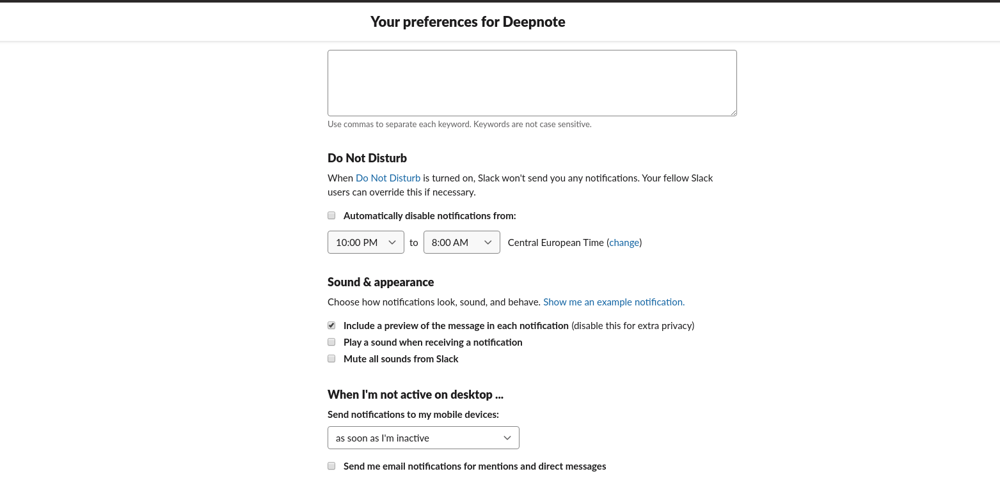

# Custom slack notification sounds

## for linux vesrion of Slack Desktop app

When it comes to having fun, Slack allows you to create custom emojis. It makes the chat experience tremendously better. However, there is no way to add custom notification sounds. There is currently only one that is worth consideration and it is the [Hummus](https://www.101soundboards.com/sounds/58615-hummus) sound. Unfortunately, most of us, including me, get quickly tired by never-ending "Hummus". In order to avoid this doom and gloom, I created a simple script that will play a random sound whenever I receive a Slack notification.

## Approach

### 1. step

We do not want to play any built-in sound when showing a notification. Hence, uncheck the "Play a sound when receiving a notification" checkbox in the Preferences section.



### 2. step

Find some cool notification sounds and add them to a folder called sounds. My playlist can be found [here](sounds).

### 3. step

Make a script "play_sound.sh" that will play a random sound whenever there is a correct keyword in the notification. I used [mpg123](https://www.mpg123.de/) for playing the sounds.

```console
#!/bin/bash
string=$1
match1="New message from"
match2="New message in"
if [[ $string =~ $match1 || $string =~ $match2]]
  then
    sound=`ls /your/path/sounds | shuf -n 1`
    mpg123 "/your/path/sounds/$sound"
fi
```

### 3. step

Make a notification listener "notification_listener.sh" that will call [play_sound.sh](play_sound.sh) when a new notification is shown.

```console
#!/bin/bash
echo "running the listener script..."
dbus-monitor "interface='org.freedesktop.Notifications'" | grep --line-buffered "string" | grep --line-buffered -e method -e ":" -e '""' -e urgency -e notify -v | grep --line-buffered '.*(?=string)|(?<=string).*' -oPi | grep --line-buffered -v '^\s*$' | grep --line-buffered '"[^"]*"' | xargs -I '{}' /bin/bash /your/path/play_sound.sh {}
```

### 4. step

Add the listener to `/etc/profile.d/` directory. <br/> Mark it as executable: `chmod +x /etc/profile.d/notification_listener.sh`

### 5. step

Enjoy your new Slack feature.

